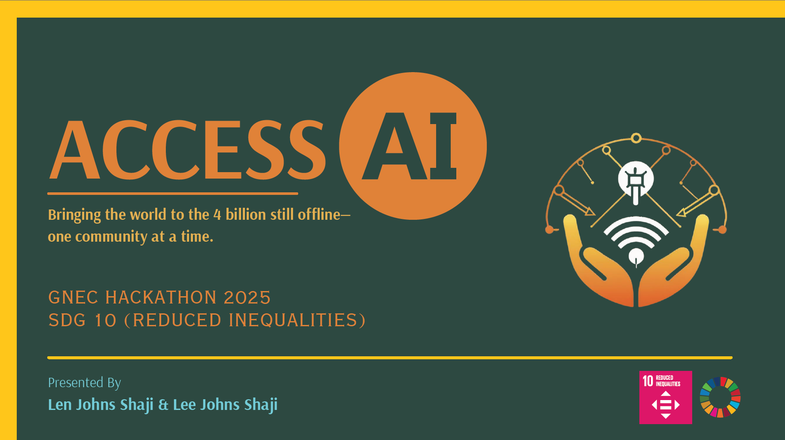

# GNEC Hackathon 2025 Spring - Global NGO Executive Committee
#### by Lee Johns Shaji & Len Johns Shaji

## Inspiration
Nearly 4 billion people around the world lack reliable internet access. This deepens education gaps, economic exclusion, and poverty cycles. While AI and digital tools are revolutionizing learning, they remain out of reach for billions.

We were inspired to bridge this digital divide by building a solution that delivers AI-powered learning — entirely offline. ACCESS AI✨ was born to bring the power of information to rural schools, libraries, and underserved communities without requiring an internet connection.

## What it does
ACCESS AI✨ is a portable, offline chatbot application powered by a local large language model (LLM). It enables users to:
- Ask questions and receive intelligent, conversational answers offline.
- Access a built-in knowledge base tailored to local education needs.
- Automatically queue web search requests to be completed when internet becomes available.
- Download the app through a local Wi-Fi access point with no internet required.
- It transforms any school or library with a USB-enabled router into an AI Learning Hub — no infrastructure needed.

## How I built it
- We used the Microsoft Phi-4 Mini Instruct model for the core chatbot, running fully offline using Hugging Face Transformers.
- FAISS is used to create a local semantic search index of our custom knowledge base.
- Streamlit powers the lightweight, web-based user interface.
- PyInstaller packages everything into a portable Windows .exe file.
- A local update mechanism allows the app to check for newer models or knowledge files when reconnected.
- SerpAPI is integrated to perform queued web searches post-connection.
- A local captive portal server redirects users to a download page hosted on the router when they connect via Wi-Fi.

## Challenges I ran into
- Packaging a large model and dependency-heavy app into a single portable executable without breaking functionality.
- Preventing launcher recursion and infinite subprocesses (solved with careful use of Python path resolution).
- Handling network connectivity checks and syncing updates only when online.
- Building an intuitive UI that works in a purely offline mode.
- Ensuring compatibility on systems with no Python pre-installed.

## Accomplishments that I'm proud of
- Built and tested a fully functional offline chatbot powered by a local LLM.
- Enabled a router-based distribution model requiring zero internet access.
- Created a seamless mechanism for deferred web search and syncing.
- Completed a full working Windows app that is ready for deployment in communities.
- Designed multilingual support through a captive portal.

## What I learned
- Offline-first AI deployment is possible — and surprisingly effective.
- Streamlit can be packaged with models if you optimize how you handle file paths and process management.
- Open-source tools like FAISS and Hugging Face make it feasible to build custom AI tools for under-resourced environments.
- Real-world deployment constraints like poor infrastructure, language diversity, and user experience are as important as the tech itself.

## What's next for ACCESS AI✨
- Develop and launch an Android version with lower storage requirements.
- Deploy a router-based prototype system with a captive portal and offline delivery via USB.
- Add monthly auto-updates for the chatbot and local knowledge base.
- Collaborate with publishers and libraries to provide academic content through the platform.
- Localize into more languages and add speech-to-text for accessibility.
- Deliver a fully functional prototype to pilot communities by September 2025.
